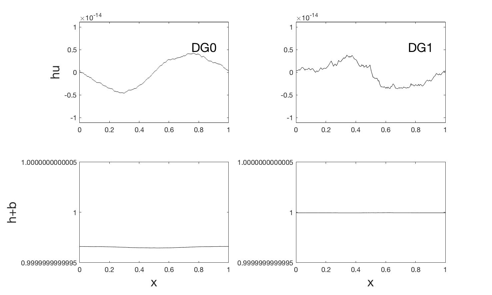

# wellbalanced_SW_DGFEM


This repository contains the source code for investigating the well-balanced property of shallow water flows integrated using the discontinuous Galerkin finite element method (DGFEM) of Rhebergen et al. (2008). The results of this investigation, first mentioned in Kent (2017) and Kent et al. (2017), is reported in detail in Kent and Bokhove (2020); the abstract is reproduced below and the source code instructions follow.

### References
* Rhebergen, S., Bokhove, O., van der Vegt, J. J. (2008): Discontinuous Galerkin finite element methods for hyperbolic nonconservative partial differential equations. Journal of Computational Physics, 227(3), 1887-1922.
* Kent, T. (2017): An idealised fluid model of Numerical Weather Prediction: dynamics and data assimilation. *PhD thesis, University of Leeds*. Available [online](http://etheses.whiterose.ac.uk/17269/).
* Kent, T., Bokhove, O., Tobias, S.M. (2017): Dynamics of an idealized fluid model for investigating convective-scale data assimilation. *Tellus A: Dynamic Meteorology and Oceanography*, 69(1), 1369332. [DOI](https://doi.org/10.1080/16000870.2017.1369332).
* Kent, T. and Bokhove, O. (2020): Ensuring 'well-balanced' shallow water flows via a discontinuous Galerkin finite element method: issues at lowest order. *arXiv preprint* [arXiv:2006.03370](https://arxiv.org/abs/2006.03370).

---

### Abstract: Ensuring 'well-balanced' shallow water flows via a discontinuous Galerkin finite element method: issues at lowest order

The discontinuous Galerkin finite element method (DGFEM) developed by Rhebergen et al. (2008) offers a robust method for solving systems of nonconservative hyperbolic partial differential equations but, as we show here, does not satisfactorily deal with topography in shallow water flows at lowest order (so-called DG0, or equivalently finite volume). **In particular, numerical solutions of the space-DG0 discretised one-dimensional shallow water equations over varying topography are not truly 'well-balanced'.** A numerical scheme is well-balanced if trivial steady states are satisfied in the numerical solution; in the case of the shallow water equations, initialised rest flow should remain at rest for all times. **Whilst the free-surface height and momentum remain constant and zero, respectively, suggesting that the scheme is indeed well-balanced, the fluid depth and topography evolve in time.** This is both undesirable and unphysical, leading to incorrect numerical solutions for the fluid depth, and is thus a concern from a predictive modelling perspective. **We expose this unsatisfactory issue, both analytically and numerically, and indicate a solution that combines the DGFEM formulation for nonconservative products with a fast and stable well-balanced finite-volume method.** This combined scheme bypasses the offending issue and successfully integrates nonconservative hyperbolic shallow water-type models with varying topography at lowest order. We briefly discuss **implications for the definition of a well-balanced scheme**, and highlight applications when higher-order schemes may not be desired, which give further value to our finding beyond its exposure alone.

## Source code
#### Software/language/versions etc.
* MATLAB '9.4.0.813654 (R2018a)'

#### Files overview
In ```matlab``` dir:

File name                   |  Summary
:--------------------------:|:--------------------------:
```run_DGFEM_SW.m```        |  Main run file: follow instructions at the top and throughout the script
```space_DGn_RHS.m```       |  Function: RHS of the space-discretised PDE for n = 0,1
```RK3_DGn.m```             |  Function: Standard 3rd-order Runge-Kutta timestepping for n = 0,1
```SWfluxNCP.m```           |  Function: the nonconservative producuct numerical flux for the SWEs
```init_cond_DGFEM_fun.m``` |  Function: initial condition projection
```plot_DGFEM_SW.m```       |  Plotting routine: plots data saved from ```run_DGFEM_SW.m```

#### Basic use
* Run ```run_DGFEM_SW.m``` with ```DG = 0```. Some figure windows will open to check progress. At the end of the simulation, the data are saved in the dir ```/data```. Repeat for ```DG = 1```.
* Run plotting routine ```plot_DGFEM_SW.m``` to produce two summary plots which are saved in the dir ```/figs```: (i) snapshots of the free-surface height h+b and topography b at various times for both DG0 and DG1; (ii) close-up profiles of the free-surface height h+b and momentum hu.
* *Optional:* repeat for different Froude number ```Fr``` or resolution ```Nk = 50, 100, 200```.

#### Summary of output


Figure (i): Snapshots of the free-surface height h+b and topography b at times at t = 0, 2.5, 5, 7.5, 10 in DG0 (piecewise constant; left) and DG1
(piecewise linear; right) simulations initialised with rest flow conditions (h+b=1 and hu=0). DG1 simulations, with piecewise linear
topography continuous across elements, maintain flow at rest for all t>0 and are therefore considered well-balanced. On the other hand, evolving
topography (and therefore fluid depth h) emerges as t>0 in DG0 simulations. Despite h+b=1 for all t at DG0, the evolving b and h means that
the scheme should not be considered truly well-balanced. Other simulation details: Nk = 200, Fr = 1.9 (supercritical), t = [0, 10].


Figure (ii): Close up snapshots at t=tmax=10 of hu (top) and h+b (bottom) for DG0 (left) and DG1 (right). Zero momentum is conserved at both DG0 and DG1 but the free surface height starts drifting at DG0 due to the diffusive h and b fields at DG0 (see fig. (i)).
